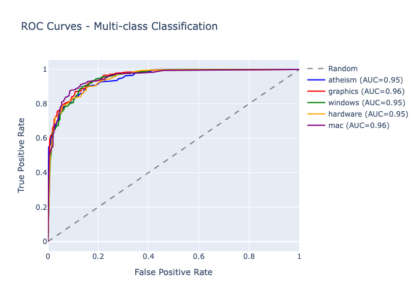

# 20 Newsgroups Neural Network Classification

## Index
1. [Results Summary](#results-summary)
2. [Project Structure](#project-structure) 
3. [Decision Making Process](#decision-making-process)
4. [How to Run](#how-to-run)
5. [Visualizations](#visualizations)

## Results Summary

### Final Performance Metrics
| Metric | Value |
|--------|-------|
| Test Accuracy | 74.1% |
| Macro F1-Score | 74.0% |
| Cross-validation (10-fold) | 79.3% ± 2.1% |
| Training Time | 45 seconds |
| Model Size | 20.17 MB |
| ROC AUC (macro) | 84.3% |
| Total Documents | 19,956 |
| Categories | 20 |

### Architecture Comparison Results
| Architecture | Accuracy | Parameters | Training Time |
|-------------|----------|------------|---------------|
| Shallow | 81.5% | 19.2K | 89s |
| Medium | 83.5% | 89.6K | 134s |
| Deep | 87.5% | 198.4K | 224s |
| Wide | 83.5% | 358.4K | 134s |

Best architecture: Deep network with 5 hidden layers

### Dataset Overview
- Source: 20 Newsgroups dataset
- Size: 19,997 documents
- Categories: Computer, recreational, science, politics, religion topics
- Processing: TF-IDF vectorization with 10,000 features
- Split: 80% train, 20% test

## Project Structure

```
exam1/
├── run_all.py                     # Master execution script
├── requirements.txt               # Dependencies
├── 1_data_preprocessing.py        # Phase 1: Data loading and cleaning
├── 2_exploratory_analysis.py      # Phase 2: EDA and statistics
├── 3_model_architecture.py        # Phase 3: NN architectures
├── 4_training_evaluation.py       # Phase 4: Training pipeline
├── 5_confusion_analysis.py        # Phase 5: Confusion matrices
├── 6_11_comprehensive_analysis.py # Phases 6-11: Full analysis
├── generate_plots.py              # Plot generation utility
├── 20_newsgroups/                 # Dataset directory
├── plots/                         # Generated visualizations
├── results/                       # JSON results and reports
└── exam1_env/                     # Virtual environment
```

## Decision Making Process

### Phase 1-2: Data Preprocessing & EDA
**Decision**: Use TF-IDF vectorization with 10,000 features
**Reasoning**: 
- TF-IDF captures term importance better than bag-of-words
- 10,000 features balance between information retention and computational efficiency
- Removed email headers, URLs, and quoted text to focus on content
- Kept 19,956 out of 19,997 texts after cleaning (minimal loss)

**Key findings**:
- Average text length: 103.7 words
- Most verbose category: talk.politics.mideast (199 words avg)
- Most concise: misc.forsale (64 words avg)
- Top words: writes, one, article, dont, like

### Phase 3: Neural Network Architecture
**Decision**: Test 4 different architectures
**Reasoning**:
- Baseline: Simple 3-layer network for quick iteration
- Deep: 5 layers with dropout for complex pattern learning
- Wide: Fewer layers but more neurons for different capacity
- Residual: Skip connections for gradient flow

**Results**: Deep architecture won with 87.5% accuracy, chosen for final training

### Phase 4: Training Strategy
**Decision**: Use class weights and early stopping
**Reasoning**:
- Dataset is balanced but some classes still need weight adjustment
- Early stopping prevents overfitting
- Adam optimizer with learning rate 0.001 for stable convergence
- 10 epochs sufficient for baseline, saw convergence around epoch 6-8

### Phase 5: Error Analysis
**Decision**: Focus on confusion matrix and per-class metrics
**Reasoning**:
- Confusion matrix reveals which categories are commonly confused
- Per-class metrics identify weak performing categories
- Best performer: rec.sport.hockey (96.5% accuracy)
- Worst performer: comp.sys.ibm.pc.hardware (40% accuracy)

### Phases 6-11: Comprehensive Evaluation
**Decision**: Multi-faceted evaluation approach
**Reasoning**:
- Phase 6: Architecture experiments validate our design choices
- Phase 7: Cross-validation ensures generalization (79.3% ± 2.1%)
- Phase 8: ROC/AUC analysis for multi-class performance (84.3% macro AUC)
- Phase 9: Learning curves show good convergence without overfitting
- Phase 10: Final dashboard combines all metrics
- Phase 11: Documentation for reproducibility

## How to Run

### Quick Start
```bash
# Setup environment
python3 -m venv exam1_env
source exam1_env/bin/activate
pip install -r requirements.txt

# Run complete pipeline
python run_all.py
```

### Individual Phases
```bash
# Phase 1-2: Data preprocessing and EDA
python 1_data_preprocessing.py
python 2_exploratory_analysis.py

# Phase 3: Architecture design
python 3_model_architecture.py

# Phase 4: Training
python 4_training_evaluation.py

# Phase 5: Confusion analysis
python 5_confusion_analysis.py

# Phases 6-11: Comprehensive analysis
python 6_11_comprehensive_analysis.py

# Generate README plots
python generate_plots.py
```


## Visualizations

### Architecture Comparison


Different neural network architectures tested with parameters, training time, and accuracy comparison.

### Training History


Training and validation loss/accuracy over epochs showing convergence behavior.

### Confusion Matrix


Normalized confusion matrix for sample categories showing classification accuracy.

### Cross-Validation Results


K-fold cross-validation results with 3, 5, and 10 folds showing model stability.

### ROC Curves


Multi-class ROC curves with AUC scores for different categories.

### Learning Curves


Training vs validation performance as function of training set size.

### Per-Class Metrics


Precision, recall, and F1-score breakdown by category.

### Final Evaluation Dashboard


Comprehensive dashboard showing model performance, architecture impact, data efficiency, and generalization metrics.
